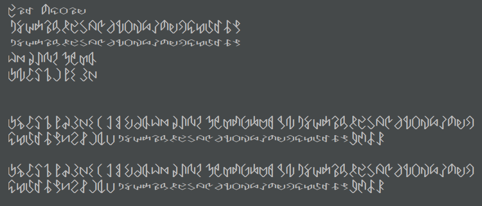

# Hex Rune Generator

It generates a font based on:
- A set of possible line segments
- Filters out mirrored copies of a rune
- Filters out runes that can't be drawn with one stroke
- Filters out runes that don't reach the top and bottom of the space
- Filters out runes with more than six segments

This is *not random*.  It is consistent, though you could play with the code to get a different kind of output.

Grab the example font if you want [here](ExampleOutput.ttf).